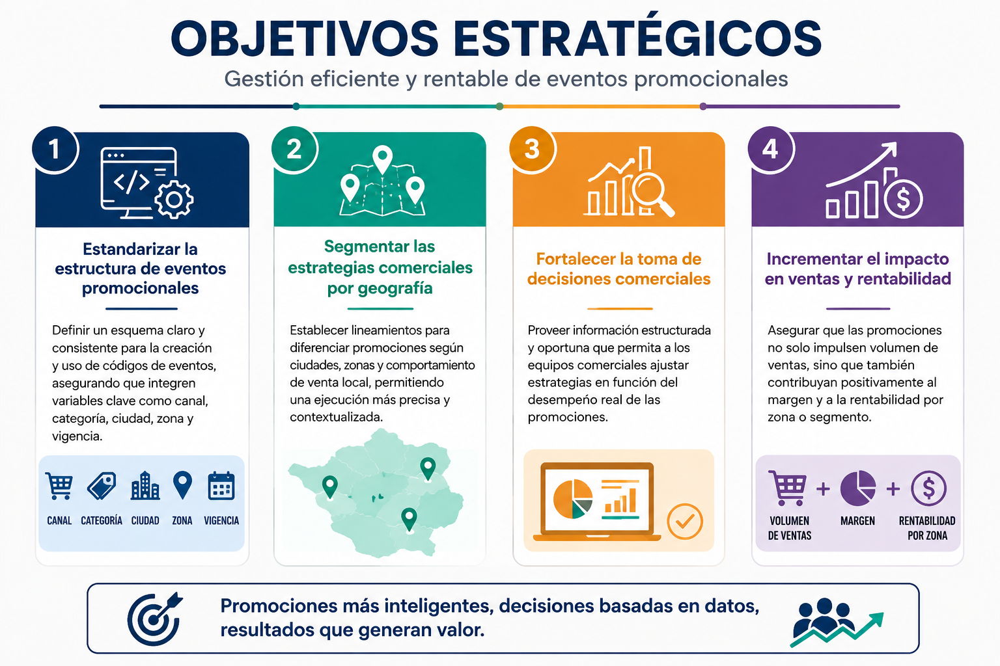
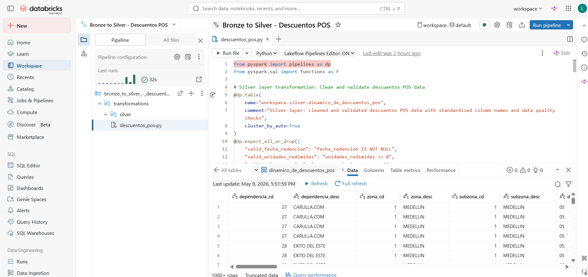
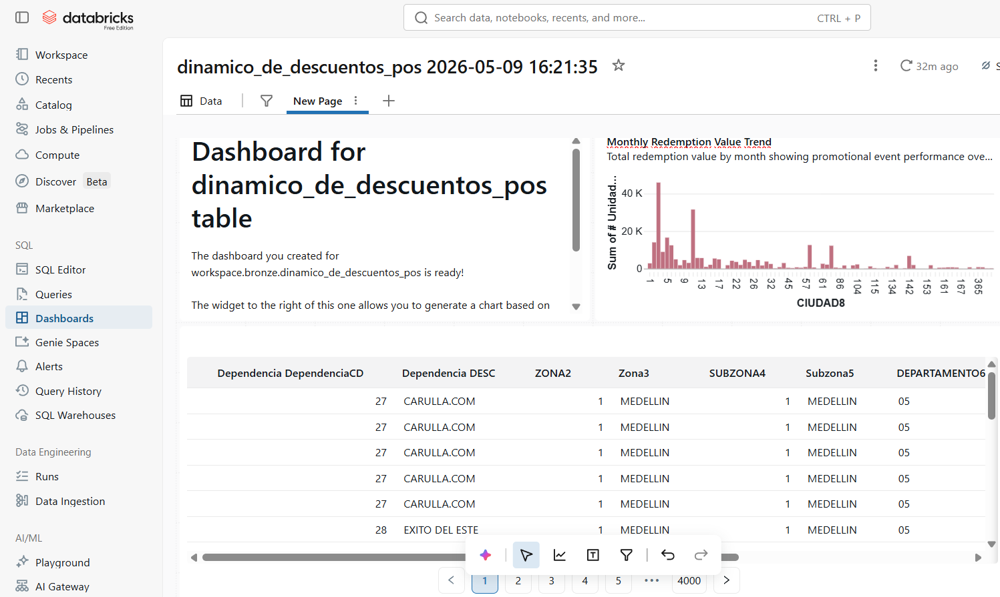
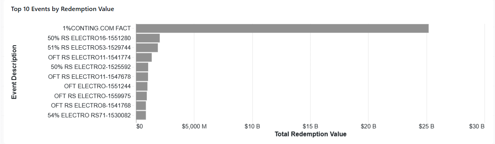
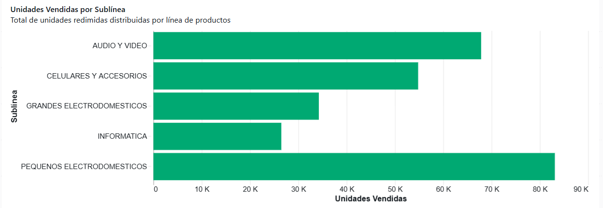
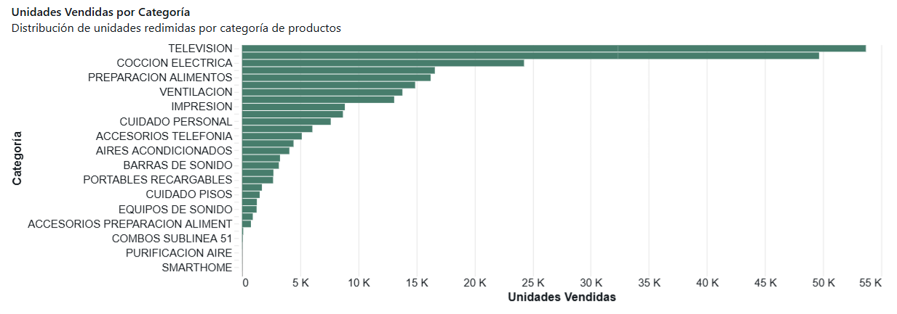
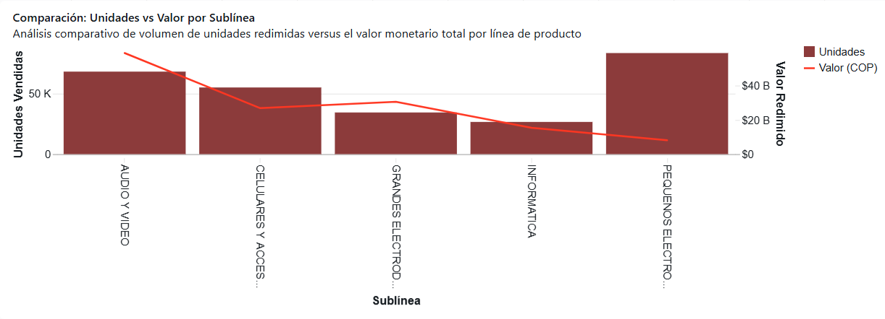
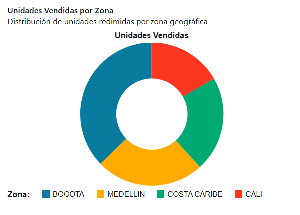

# Trabajo Final BigData

Diseñar un tablero que articule la gestión de eventos promocionales con la segmentación geográfica y comercial, permitiendo definir, ejecutar y evaluar estrategias de ventas más precisas, alineadas con las particularidades de cada segmento y orientadas a maximizar el desempeño comercial.

<h2 align="center">Objetivos Estratégicos</h2>

  

# Insercion de data en DTBS pasando de Bronze To Silver 
<h2 align="center">Bronze To Silver</h2>

  

# Dashboard
<h2 align="center">Dasboard</h2>

  

 

# Top 10 Eventos Promocionales por Valor Redimido (Abril 2026)
Total acumulado Top 10: $4.2 trillones COP (representa aproximadamente el 30% del valor total redimido)

1. OFT ELECTRO-1551244 → $983.8B COP (23.4%)
El evento más exitoso del mes. "OFT" sugiere una oferta especial en electrónica. Este único evento generó casi $1 trillón COP en redenciones, representando casi una cuarta parte del valor total.

2. 47% RS ELECTRO4-1546803 → $644.7B COP (15.3%)
Descuento del 47% en categoría electrónica. El alto porcentaje de descuento generó el segundo mayor valor, indicando productos de alto ticket (probablemente grandes electrodomésticos o TVs).

3. OFT ELECTRO RS9-1543556 → $581.5B COP (13.8%)
Otra oferta especial de electrónica, tercera en valor. La combinación "OFT" + "RS" sugiere una oferta especial con condiciones de recompra o fidelización.

4. 46% RS ELECTRO1-1561327 → $410.4B COP (9.8%)
Descuento del 46% similar al #2, generando casi la mitad del valor. Alta efectividad en categoría electrónica.

5. OFT ELECTRO3-1554298 → $373.4B COP (8.9%)
Oferta especial variante 3, manteniendo el patrón de alto valor en eventos de electrónica.

6. OFT LICORES RS-1544690 → $325.5B COP (7.7%)
Único evento no-electrónico en el Top 10. Demuestra que licores también genera valor significativo, aunque con ticket promedio más bajo que electrónica.

7. 50% RS ELECTRO1-1547518 → $284.5B COP (6.8%)
Descuento del 50% (el más alto entre los top), pero genera menos valor que eventos con 46-47%, sugiriendo productos de menor precio o menor volumen de unidades.

8. DCTO $1750000-1556819 → $223.5B COP (5.3%)
Descuento fijo de $1.75M COP. Estrategia diferente (monto fijo vs porcentaje), probablemente aplicada a productos premium de muy alto ticket.

9. 70% RS ELECTRO2-1556810 → $200.1B COP (4.8%)
Descuento del 70% (el más agresivo), pero genera menos valor absoluto. Probablemente liquidación de inventario o productos de menor costo inicial.

10. OFT ELECTRO7-1544831 → $188.2B COP (4.5%)
Cierra el Top 10 con otra oferta especial de electrónica.
<h2 align="center">Top 10</h2>

  

 

# Unidades Vendidas por Sublínea 
<h2 align="center">Unidades Vendidas por Sublínea</h2>

  

Los resultados muestran:
PEQUENOS ELECTRODOMESTICOS lidera con 83,103 unidades vendidas.
AUDIO Y VIDEO (67,845 unidades).
CELULARES Y ACCESORIOS (54,806 unidades). 
Las categorías con menores unidades son GRANDES ELECTRODOMESTICOS (34,250) e INFORMATICA (26,482).

# Unidades Vendidas por Categoría
<h2 align="center">Unidades Vendidas por Categoría</h2>

  

TELEVISION lidera con 53,679 unidades (20% del total)
CELULARES en segundo lugar con 49,655 unidades (19% del total)
COCCION ELECTRICA con 24,263 unidades (9% del total)
REFRIGERACION y PREPARACION ALIMENTOS le siguen con 16,589 y 16,227 unidades respectivamente
Las categorías de mayor volumen están relacionadas con entretenimiento (TV, audio) y telefonía, mientras que las categorías de garantías extendidas y calefacción tienen volúmenes mínimos.

# Datos Detallados por Sublínea (Abril 2026)
1. PEQUENOS ELECTRODOMESTICOS
Unidades: 83,103 (31.4% del total)
Valor: $8.08B COP (5.8% del valor total)
Valor promedio/unidad: $97,228 COP
Perfil: Alto volumen, bajo ticket - Productos como licuadoras, tostadoras, planchas, cafeteras. Estrategia de venta masiva con márgenes unitarios bajos.
2. AUDIO Y VIDEO
Unidades: 67,845 (25.7% del total)
Valor: $58.82B COP (42.1% del valor total)
Valor promedio/unidad: $866,835 COP
Perfil: Alto valor, alto volumen - La categoría más rentable. Incluye televisores, barras de sonido, equipos de audio. 8.9x más valor por unidad que pequeños electrodomésticos.
3. CELULARES Y ACCESORIOS
Unidades: 54,806 (20.7% del total)
Valor: $26.75B COP (19.1% del valor total)
Perfil: Equilibrado - Smartphones y accesorios. Volumen moderado con valor medio-alto.
Valor promedio/unidad: $488,007 COP
4. GRANDES ELECTRODOMESTICOS
Unidades: 34,250 (13.0% del total)
Valor: $30.43B COP (21.8% del valor total)
Valor promedio/unidad: $888,614 COP
Perfil: Bajo volumen, alto ticket - Neveras, lavadoras, estufas, aires acondicionados. Menor cantidad de unidades pero 9.1x más valor por unidad que pequeños electrodomésticos.
5. INFORMATICA
Unidades: 26,482 (10.0% del total)
Valor: $15.31B COP (11.0% del valor total)
Valor promedio/unidad: $578,151 COP
Perfil: Bajo volumen, ticket medio-alto - Computadores, impresoras, periféricos. Menor penetración pero valor unitario significativo.

<h2 align="center">Comparación: Unidades vs Valor por Sublínea</h2>

  

# Unidades por zona
<h2 align="center">Unidades vendidas por zona</h2>

  

BOGOTA domina el mercado con 99,174 unidades (37% del total) y $50.1B COP (36% del valor), estableciéndose como la zona más importante en volumen y valor.

MEDELLIN ocupa el segundo lugar con 65,318 unidades (25%) generando $36.1B COP (26%), mostrando proporcionalidad entre volumen y valor.

COSTA CARIBE y CALI mantienen patrones similares entre unidades y valor, indicando tickets promedio consistentes con el resto de zonas.

La distribución proporcional entre unidades y valor sugiere que el valor unitario promedio es relativamente homogéneo entre zonas, sin variaciones significativas en el ticket promedio por ubicación geográfica.
       
